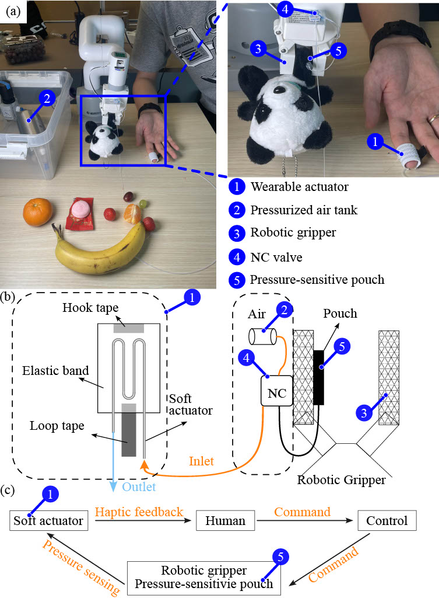

# TouchDrive: Electronics-Free Tactile Sensing Interface for Assistive Grasping
## SystemOverview

https://arxiv.org/abs/2605.06432
## Abstract
Assistive robotic grasping plays an important role
in enabling safe and adaptive manipulation of diverse objects.
However, existing systems often rely on electronic sensing and
multi-stage processing pipelines, increasing system complexity
and reducing accessibility. To address these limitations, we
present TouchDrive, a cost-effective, electronics-free tactile sens-
ing interface for assistive grasping. TouchDrive directly converts
contact forces into pneumatic feedback through valve-mediated
switching, integrating sensing, signal generation, and feedback
within a single passive mechanical loop. The system can be em-
ployed using a pneumatic normally closed valve, a compressed
air tank, sensing element, and haptic feedback actuator without
electronics. By delivering tactile cues, TouchDrive empowers
users to modulate grasp forces, enabling precise and robust
delicate manipulation of compliant and fragile objects. The
interface has been validated across diverse robotic platforms,
consistently demonstrating reliable performance and practical
applicability in assistive grasping tasks, such as handling fruits
and everyday items (up to 20 objects).
## Doc Folder
- TouchDrive: Electronics-Free Tactile Sensing Interface for Assistive Grasping.pdf
- TouchDrive: Electronics-Free Tactile Sensing Interface for Assistive Grasping.poster
## CAD & STL Folder
- STL for normally closed valve
- 
## Workshop
Robotac in ICRA 2026